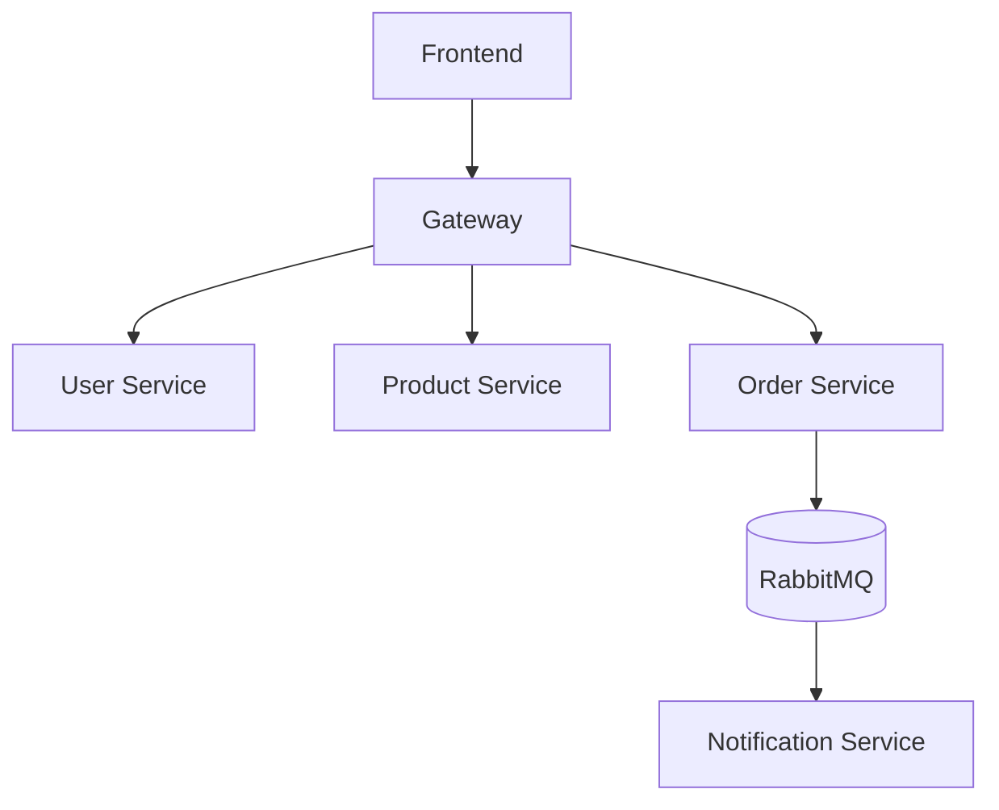

# Микросервисная архитектура маркетплейса

## 1. Введение

Маркетплейсы — это сложные системы, в которых множество пользователей, товаров, заказов и взаимодействий. Для обеспечения масштабируемости, гибкости и надёжности современный подход — использовать **микросервисную архитектуру**.

## 2. Преимущества микросервисов

- **Масштабируемость:** можно масштабировать отдельные сервисы, а не весь монолит.
- **Независимость:** сервисы пишутся, тестируются и разворачиваются независимо.
- **Устойчивость:** сбой одного сервиса не “роняет” всю систему.
- **Гибкость:** разные сервисы можно писать на разных языках и технологиях.

## 3. Архитектура маркетплейса

```
Пользователь/Фронтенд
       │
       ▼
  [API Gateway] ←→ [Auth/JWT]
     │   │   │   │
     ▼   ▼   ▼   ▼
 [User][Product][Order][Notification]
                    │
                  (RabbitMQ)
```

### Сервисы:
- **gateway** — центральная точка входа, маршрутизация и аутентификация.
- **user-service** — регистрация, аутентификация, профили пользователей.
- **product-service** — каталог товаров, поиск, фильтрация.
- **order-service** — заказы, статусы, история.
- **notification-service** — отправка уведомлений, работа с очередями.
- **libs** — общие библиотеки (например, JWT).
- **frontend** — SPA-клиент для пользователей.

## 4. Взаимодействие сервисов

- Все сервисы (кроме notification) общаются через REST API.
- Notification-service подписан на события (RabbitMQ): например, при создании заказа — приходит уведомление.
- Gateway проверяет JWT, отправляет запросы нужному сервису.

## 5. Безопасность

- JWT для аутентификации и авторизации.
- API Gateway валидирует токены и ограничивает доступ.

## 6. Технологии

- **PHP (Laravel/Slim)** — для всех сервисов.
- **RabbitMQ** — очереди сообщений.
- **MySQL** — базы данных сервисов.
- **Vue.js** — фронтенд.
- **Docker, docker-compose** — контейнеризация и оркестрация.

---

## 7. Диаграмма взаимодействия



---

## 8. Краткое описание сервисов

- **gateway/**: управление маршрутами, аутентификация, проксирование запросов.
- **user-service/**: CRUD пользователей, выдача JWT токенов.
- **product-service/**: CRUD товаров, поиск.
- **order-service/**: оформление и отслеживание заказов, публикация событий в очередь.
- **notification-service/**: подписка на очередь и отправка уведомлений.
- **libs/**: общие утилиты, например, для работы с JWT.
- **frontend/**: клиентский интерфейс.

---

## 9. Типовой сценарий

1. Пользователь регистрируется (user-service).
2. Входит в систему — получает JWT.
3. Просматривает каталог товаров (product-service).
4. Оформляет заказ (order-service) — событие уходит в RabbitMQ.
5. notification-service отправляет уведомление пользователю.

---

**Далее мы перейдем к структуре репозитория и docker-compose.yml.**